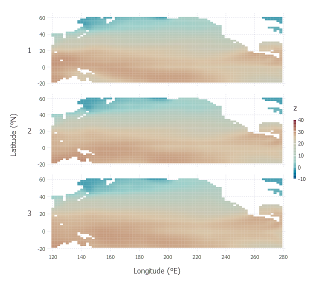
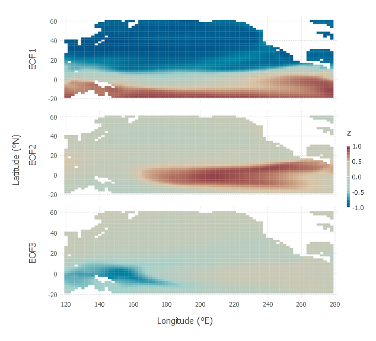

<a id='SpacetimeFields.jl-Documentation-1'></a>

# SpacetimeFields.jl Documentation


<a id='Types-and-Functions-1'></a>

## Types and Functions

<a id='SpacetimeFields.extent' href='#SpacetimeFields.extent'>#</a>
**`SpacetimeFields.extent`** &mdash; *Type*.


extent(xmin, xmax, ymin, ymax) An `extent` object

<a id='SpacetimeFields.stfield' href='#SpacetimeFields.stfield'>#</a>
**`SpacetimeFields.stfield`** &mdash; *Type*.


stfield(data, lon, lat, good, time) A `stfield` object

<a id='Base.convert' href='#Base.convert'>#</a>
**`Base.convert`** &mdash; *Function*.


convert(::Type{DataFrame}, x::stfield, time, label) Convert `stfield` object to a `DataFrame`

convert(::Type{DataFrame}, x::stfield, time) Convert `stfield` object to a `DataFrame`

convert(::Type{Matrix}, x::stfield) Convert `stfield` object to a `Matrix`.

<a id='Base.copy' href='#Base.copy'>#</a>
**`Base.copy`** &mdash; *Function*.


copy(x::stfield; layers=1) Creates a copy of an `stfield` object

<a id='Base.show' href='#Base.show'>#</a>
**`Base.show`** &mdash; *Function*.


show(io::IO,x::stfield) Display info about a `stfield` object

<a id='SpacetimeFields.llgrid' href='#SpacetimeFields.llgrid'>#</a>
**`SpacetimeFields.llgrid`** &mdash; *Function*.


llgrid(x::stfield) Return a grid of longitude and latitude values from a `stfield` object

llgrid(fname::ASCIIString; start=[1], count=[-1]) Read a NetCDF file with the given fname, and return  a grid of longitude and latitude values 

<a id='SpacetimeFields.nc2field' href='#SpacetimeFields.nc2field'>#</a>
**`SpacetimeFields.nc2field`** &mdash; *Function*.


nc2field{T<:ASCIIString}(fname::T, varname::T, ext::extent) Convert NetCDF data to a `stfield` object


<a id='Example-1'></a>

## Example


```julia
using StatsBase: zscore
using DataFrames, Gadfly, SpacetimeFields

f2 = "ersst.mnmean.v4.nc"

ext1 = extent(121, 279 ,-19, 59)
r1 = nc2field(f2, "sst", ext1)

D1 = convert(DataFrame, r1, 1:3)

coord_map = Coord.cartesian(xmin=D1[1,:lon]-1, xmax=D1[end,:lon]+1, ymin=D1[1,:lat]-1, ymax=D1[end,:lat]+1)
xtix = Guide.xticks(ticks=collect(120:20:280))
ytix = Guide.yticks(ticks=collect(-20:20:60))

 p = plot(D1, ygroup=:g,
    x=:lon, y=:lat, color= :z,
    Geom.subplot_grid(coord_map, Geom.rectbin, xtix, ytix),
    Guide.xlabel("Longitude (°E)"), Guide.ylabel("Latitude (°N)")
 ) 

```





```julia
M1 = convert(Matrix, r1)
U = svdfact(zscore(M1,1))[:U]
b = cor(U[:,1:3], M1)
r2 = copy(r1, layers=1:3)
r2.data[repmat(r2.good, 3)] = b'

label = ["EOF$j" for j in 1:3 ]
D2 = convert(DataFrame, r2, 1:3, label)

p2 = plot(D2, ygroup=:g,
    x=:lon, y=:lat, color= :z,
    Geom.subplot_grid(coord_map, Geom.rectbin, xtix, ytix),
    Guide.xlabel("Longitude (°E)"), Guide.ylabel("Latitude (°N)")
) 

```




