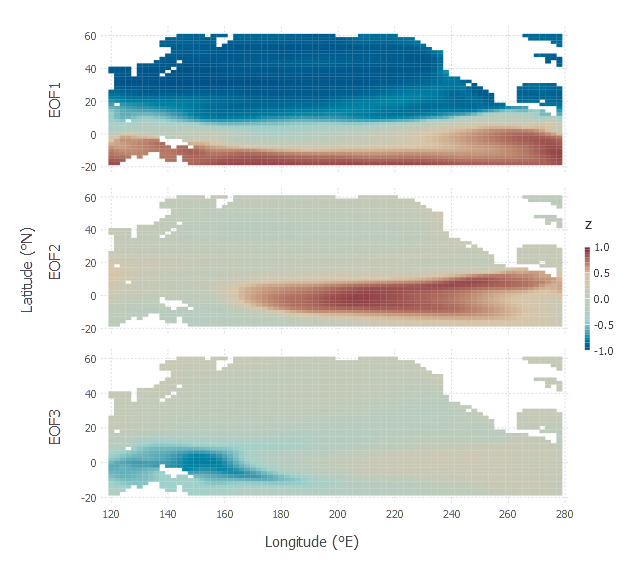

# SpacetimeFields.jl Documentation

## Types and Functions

```@autodocs
Modules = [SpacetimeFields]
Order   = [:type, :function]
```

## Example

```julia
using LinearAlgebra
using StatsBase: cor, zscore
using DataFrames, Gadfly, SpacetimeFields

f2 = "ersst.mnmean.v4.nc"

ext1 = extent(121, 279 ,-19, 59)
r1 = nc2field(f2, "sst", ext1, llnames=["lon","lat"])

D1 = convert(DataFrame, r1, 1:3)

coord_map = Coord.cartesian(xmin=D1[1,:lon]-1, xmax=D1[end,:lon]+1, ymin=D1[1,:lat]-1, ymax=D1[end,:lat]+1)
xtix = Guide.xticks(ticks=120:20:280)
ytix = Guide.yticks(ticks=-20:20:60)

 p = plot(D1, ygroup=:g,
    x=:lon, y=:lat, color= :z,
    Geom.subplot_grid(coord_map, Geom.rectbin, xtix, ytix),
    Guide.xlabel("Longitude (°E)"), Guide.ylabel("Latitude (°N)")
 ) 

```


```julia
M1 = convert(Matrix, r1)
U = svd(zscore(M1,1)).U
b = cor(U[:,1:3], M1)
r2 = copy(r1, layers=1:3)
r2.data[repeat(r2.good, outer=3)] = b'

label = ["EOF$j" for j in 1:3 ]
D2 = convert(DataFrame, r2, 1:3, label)

p2 = plot(D2, ygroup=:g,
    x=:lon, y=:lat, color= :z,
    Geom.subplot_grid(coord_map, Geom.rectbin, xtix, ytix),
    Guide.xlabel("Longitude (°E)"), Guide.ylabel("Latitude (°N)")
) 

```




